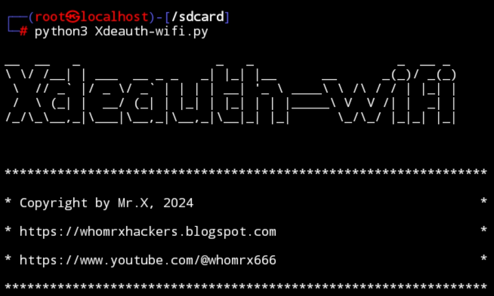

# Xdeauth-wifi 


## introduction
Xdeauth-wifi is a tool used to carry out DDOS attacks on a WiFi or is usually called a WiFi deauther

## Instalations
```
$ apt update -y && apt upgrade -y
$ apt install git
$ apt install python3 -y
$ git clone https://github.com/Whomrx666/Xdeauth-wifi 
$ cd Xdeauth-wifi 
$ python3 Xdeauth-wifi.py
```

### **Things needed for the tool to run**

This tool requires several things that you must have so that it can run normally and can be used as efficiently as possible:

- Kali linux / nethunter / ubuntu / debian/ and others
- Wireless adapter that supports monitor mode
- Sudo access
- And of course the internet

## Note!
The brand of wireless adapter that I use is Tp-link Tl-wn722N version 1.10 {support monitor mode}


## Instructions
- **first**: Install tools according to the instructions above
- **second**: Make sure you have connected your wireless adapter before running the tool
- **third**: Go to tools and select your wireless adapter network, usually Wlan0
- **four**: Automatic tools scan existing networks
- **last**: Select the network you want to turn off according to the existing number, then the tool will automatically deauth the network until it turns off

### Need tutorial video!
[Click here](https://t.me/WeAreOne_4/4151/6116)


## Observation
This is a tool for education only, I am not responsible for any misuse
### Original Author
<a href="https://github.com/Whomrx666"></a>

### <<< If you copy , Then Give me The Credits >>>

## CONNECT WITH ME :

[](https://whomrxhackers.blogspot.com/)
[](https://twitter.com/whomrx666)
[](https://youtube.com/@whomrx666)
[](https://facebook.com/https://www.facebook.com/whomrx.666)
[](https://t.me/@Whomr_X)
[](mailto:whomrx666@gmail.com)
[](https://www.tiktok.com/@whomr.x)

**If you want to donate, click on the button**
<a href="https://saweria.co/whomrx"></a>

### Visitors :
